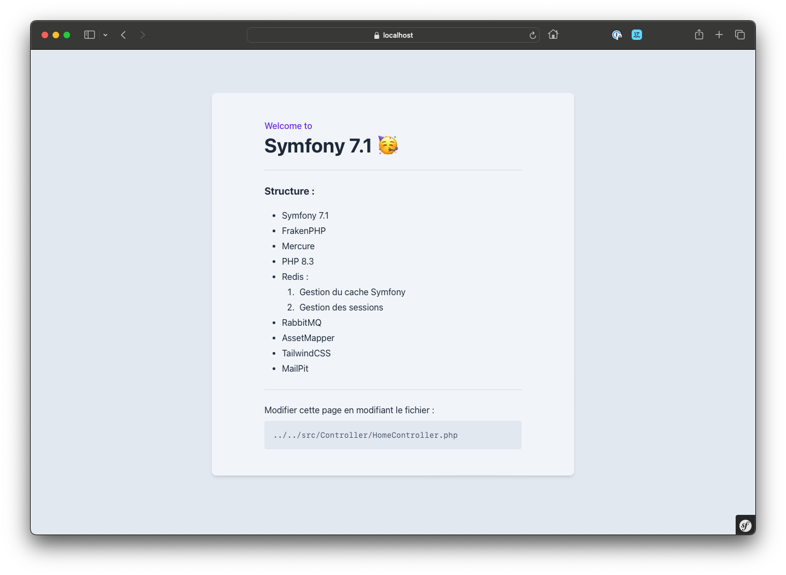

# Projet Symfony 6.3 / Docker



## Composants pré-installés :
* PHP v.8.3 ;
* PostgresSQL ;
* Redis :
    * Gestion du cache Symfony ;
    * Gestion des sessions ;
* RabbitMQ ;
* FrakenPHP
* TailwindCSS avec AssetMapper.

Un fichier `make` est présent avec des commandes de bases pour gérer le projet. Pour connaitre les commandes, taper `make help` dans un terminal.

## Installation

```shell
make start
```

> Après installation des conteneurs Docker, patienter quelques minutes que le conteneur PHP finissent l'installation avec Composer en autres.

## Docker

Compiler et lancer le serveur Docker :
```shell
make build ## compile les containers
make up-dev ## Lance les containers en mode dev.
make down ## Arrête les containers
# make start ## Regroupe les commandes "make build" et "make up"
```

## Base de données

Il n'y a pas d'interface pour la gestion de la base de données. Passer par son IDE.

```shell
make reset-db ## Installe la basse de données et les migrations
make fixtures ## Remplis la base de données de... donneés
```

## Serveur

Les URLs générées :
```shell
https://localhost ## Projet Symfony
https://localhost/.well-known/mercure ## Mercure Hub
```

Les interfaces :
```shell
http://localhost:15672 ## RabbitMQ
http://localhost:8025 ## MailPit
```

Identifiants de l'interface RabbitMQ :
```text
Username: guest
Password: guest
```

Supprimer le cache Symfony & Redis :
```shell
make cc
```

## Assets

Les fichiers `CSS` et `JS` se situent dans le dossier `assets` à la racine du projet.  
Il est possible d'utiliser Stimulus UX si besoin.

```shell
make assets-compile
make assets-watch
```

Ne pas oublier de build pour la prod. :
```shell
make assets-minify
```

## Qualité du code

La commande ci-dessous permet de tester le code avec : PHP-CS-Fixer, PHPStan et PHP Security Checker

```shell
make quality ## Lance des tests de qualités
```
